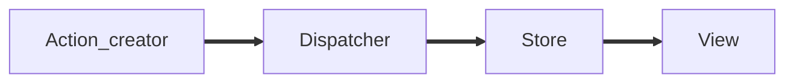
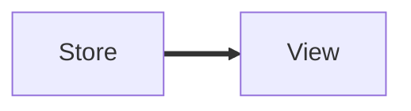
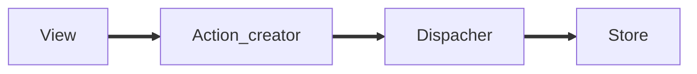
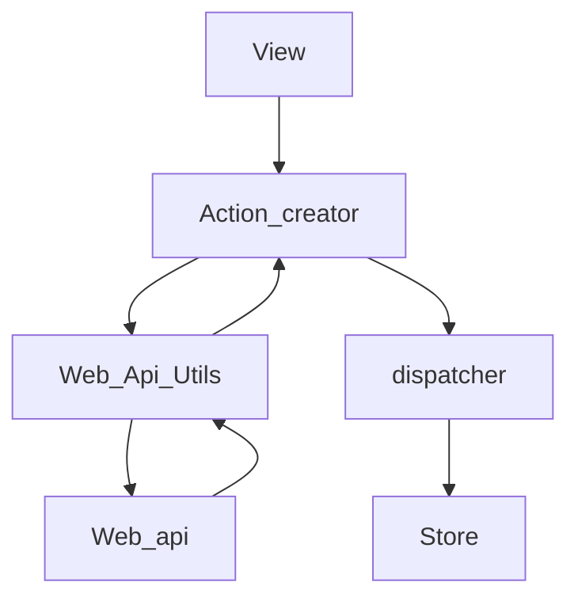

---
# try also 'default' to start simple
theme: unicorn
colorSchema: light

# apply any windi css classes to the current slide
class: 'text-center'
# https://sli.dev/custom/highlighters.html
highlighter: shiki
# show line numbers in code blocks
lineNumbers: false
# some information about the slides, markdown enabled

drawings:
  persist: false


---


# Working with Angular

Key concepts to have a professional code.

<div class="pt-12">
  <span @click="$slidev.nav.next" class="px-2 py-1 rounded cursor-pointer" hover="bg-white bg-opacity-10">
    Press Space for next page <carbon:arrow-right class="inline"/>
  </span>
</div>

<div class="abs-br m-6 flex gap-2">  
  <a href="https://github.com/oscarandrespabonestrella/playground_angular" target="_blank" alt="GitHub"
    class="text-xl icon-btn opacity-50 !border-none !hover:text-white">
    <carbon-logo-github />
  </a>
</div>

<!--
The last comment block of each slide will be treated as slide notes. It will be visible and editable in Presenter Mode along with the slide. [Read more in the docs](https://sli.dev/guide/syntax.html#notes)
-->

---
layout: table-contents
gradientColors: ['#8EC5FC', '#E0C3FC']
---


# Table of contents

1. <Link to="3"> Everyday Types </Link>
2. <Link to="13"> Template driven forms/ Reactive forms </Link>
3. <Link to="29"> Communication Between components </Link>
4. <Link to="36">Observable management and Rxjx</Link>
5. <Link to="45"> Pipes </Link>
6. <Link to="49">Nested routing</Link>
7. <Link to="53">Internal proxy configuration</Link>
8. <Link to="59">Styles and view encapsulation	(CSS pre-processors)</Link>
9. <Link to="62">Angular lifecycle</Link>
10. <Link to="69">Route guardians</Link>
11. 11. <Link to="70"> Flux Architecture </Link>
12. <Link to="75"> Workspace and project file structure </Link>
13. <Link to="79"> Angular animations </Link>
14. <Link to="85"> Angular universal </Link>
15. <Link to="93"> angular.json / tsconfig.ts </Link>

---


# Everyday Types

### The primitives: string, number, and boolean

|     |     |
| --- | --- |
| <kbd>string</kbd> | represents string values like <kbd>"Hello, world"</kbd> |
| <kbd>number</kbd> | is for numbers like <kbd>42</kbd>. JavaScript does not have a special runtime value for integers, so there’s no equivalent to <kbd>int</kbd> or <kbd>float</kbd> - everything is simply <kbd> number</kbd> |
| <kbd>boolean </kbd> |  is for the two values <kbd>true</kbd> and <kbd> false</kbd> |


> The type names <kbd> String</kbd>, <kbd>Number</kbd>, and <kbd>Boolean</kbd> (starting with capital letters) are legal, but refer to some special built-in types that will very rarely appear in your code. Always use string, number, or boolean for types.


---

### Arrays

To specify the type of an array like ``[1, 2, 3]``, you can use the syntax ``number[]``; this syntax works for any type (e.g. ``string[]`` is an array of strings, and so on). You may also see this written as ``Array<number>``, which means the same thing. 


> Note that [number] is a different thing; refer to the section on Tuples.


<br />

### any
TypeScript also has a special type,``any``, that you can use whenever you don’t want a particular value to cause typechecking errors.

``noImplicitAny``
<br />

When you don’t specify a type, and TypeScript can’t infer it from context, the compiler will typically default to any.
You usually want to avoid this, though, because any isn’t type-checked. Use the compiler flag noImplicitAny to flag any implicit any as an error.

---

### Object Types
Apart from primitives, the most common sort of type you’ll encounter is an ___object type___. This refers to any JavaScript value with properties, we simply list its properties and their types.

For example, here’s a function that takes a point-like object:

```ts {monaco}
function printCoord(pt: { x: number; y: number }) {
  console.log("The coordinate's x value is " + pt.x);
  console.log("The coordinate's y value is " + pt.y);
}
printCoord({ x: 3, y: 7 });
```

<br/>

#### Optional Properties
Object types can also specify that some or all of their properties are optional. To do this, add a ? after the property name:

```ts {monaco}
function printName(obj: { first: string; last?: string }) {
  // ...
}
// Both OK
printName({ first: "Bob" });
printName({ first: "Alice", last: "Alisson" });
```


---

### Union Types
TypeScript’s type system allows you to build new types out of existing ones using a large variety of operators.
<br/>

#### Defining a Union Type
The first way to combine types you might see is a union type. A union type is a type formed from two or more other types, representing values that may be any one of those types. We refer to each of these types as the union’s members.

```ts {monaco}
function printId(id: number | string) {
  console.log("Your ID is: " + id);
}
// OK
printId(101);
// OK
printId("202");
// Error
printId({ myID: 22342 });
// Argument of type '{ myID: number; }' is not assignable to parameter of type 'string | number'.
```


<!--
TypeScript will only allow an operation if it is valid for every member of the union. For example, if you have the union string | number, you can’t use methods that are only available on string:
function printId(id: number | string) {
  console.log(id.toUpperCase());
Property 'toUpperCase' does not exist on type 'string | number'.
  Property 'toUpperCase' does not exist on type 'number'.
}

if (typeof id === "string") {
    // In this branch, id is of type 'string'
    console.log(id.toUpperCase());
  } else {
-->


---

### Type Aliases

We’ve been using object types and union types by writing them directly in type annotations. This is convenient, but it’s common to want to use the same type more than once and refer to it by a single name.

A type alias is exactly that - a name for any type. The syntax for a type alias is:

```ts 
type Point = {
  x: number;
  y: number;
};
 
// Exactly the same as the earlier example
function printCoord(pt: Point) {
  console.log("The coordinate's x value is " + pt.x);
  console.log("The coordinate's y value is " + pt.y);
}
 
printCoord({ x: 100, y: 100 });
```
<br/>

You can actually use a type alias to give a name to any type at all, not just an object type. For example, a type alias can name a union type:

```ts 
type ID = number | string;
```


---

### Interfaces
An interface declaration is another way to name an object type:

```ts 
interface Point {
  x: number;
  y: number;
}
 
function printCoord(pt: Point) {
  console.log("The coordinate's x value is " + pt.x);
  console.log("The coordinate's y value is " + pt.y);
}
 
printCoord({ x: 100, y: 100 });
```

Just like when we used a type alias above, the example works just as if we had used an anonymous object type. TypeScript is only concerned with the structure of the value we passed to printCoord - it only cares that it has the expected properties.


---

### Differences Between Type Aliases and Interfaces
Type aliases and interfaces are very similar, and in many cases you can choose between them freely. Almost all features of an interface are available in type, the key distinction is that a type cannot be re-opened to add new properties vs an interface which is always extendable.

<div grid="~ cols-2 gap-2" m="-t-2">

```ts {all|7-10|all}
// Extending an interface

interface Animal {
  name: string
}

interface Bear extends Animal {
  honey: boolean
}

const bear = getBear() 
bear.name
bear.honey
```
```ts {all|7-10|all}
// Extending a type via intersections

type Animal = {
  name: string
}

type Bear = Animal & { 
  honey: boolean 
}

const bear = getBear();
bear.name;
bear.honey;
```
</div>


---


<div grid="~ cols-2 gap-2" m="-t-2">

```ts 
//Adding new fields to an existing interface

interface Window {
  title: string
}

interface Window {
  ts: TypeScriptAPI
}

const src = 'const a = "Hello World"';
window.ts.transpileModule(src, {});
```


```ts
//A type cannot be changed after being created

type Window = {
  title: string
}

type Window = {
  ts: TypeScriptAPI
}

 // Error: Duplicate identifier 'Window'.
```
</div>


---

### Type Assertions
Sometimes you will have information about the type of a value that TypeScript can’t know about.

For example, if you’re using document.getElementById, TypeScript only knows that this will return some kind of HTMLElement, but you might know that your page will always have an HTMLCanvasElement with a given ID.

In this situation, you can use a type assertion to specify a more specific type:

```ts
const myCanvas = document.getElementById("main_canvas") as HTMLCanvasElement;

const myCanvas = <HTMLCanvasElement>document.getElementById("main_canvas");
```

> ***Reminder***: Because type assertions are removed at compile-time, there is no runtime checking associated with a type assertion. There won’t be an exception or null generated if the type assertion is wrong.

<br/>

---

### Literal Types
we can refer to specific strings and numbers in type positions

```ts
let x: "hello" = "hello";
// OK
x = "hello";
// ...
x = "howdy";
//Type '"howdy"' is not assignable to type '"hello"'.
```

It’s not much use to have a variable that can only have one value!

But by combining literals into unions, you can express a much more useful concept - for example, functions that only accept a certain set of known values:

```ts
function printText(s: string, alignment: "left" | "right" | "center") {
  // ...
}
printText("Hello, world", "left");
printText("G'day, mate", "centre");
//Argument of type '"centre"' is not assignable to parameter of type '"left" | "right" | "center"'.
```

---

# Template driven forms
Template-driven forms use two-way data binding to update the data model in the component as changes are made in the template and vice versa.

```ts
import { Component } from '@angular/core';

@Component({
  selector: 'app-template-favorite-color',
  template: `
    Favorite Color: <input type="text" [(ngModel)]="favoriteColor">
  `
})
export class FavoriteColorComponent {
  favoriteColor = '';
}
```

<br/>

> Template-driven forms are suitable for small or simple forms, while reactive forms are more scalable and suitable for complex forms. 

---

### Build a template-driven form
Template-driven forms rely on directives defined in the FormsModule.

<br/>

|||
|---|---|
|NgModel|	Reconciles value changes in the attached form element with changes in the data model, allowing you to respond to user input with input validation and error handling.|
|NgForm|	Creates a top-level FormGroup instance and binds it to a ``<form>`` element to track aggregated form value and validation status. As soon as you import FormsModule, this directive becomes active by default on all ``<form>`` tags. You don't need to add a special selector. |
|NgModelGroup|	Creates and binds a FormGroup instance to a DOM element.|

---

<div grid="~ cols-2 gap-2" m="-t-2">
  
  
</div>


---

# Reactive forms
Reactive forms provide a model-driven approach to handling form inputs whose values change over time.


<div grid="~ cols-2 gap-2" m="-t-2">

  <div>

  ***Register the reactive forms module***

  To use reactive form controls, import ReactiveFormsModule from the @angular/forms package and add it to your NgModule's imports array.

  </div>

  <div>

  
  ```ts
  import { ReactiveFormsModule } from '@angular/forms';

  @NgModule({
    imports: [
      // other imports ...
      ReactiveFormsModule
    ],
  })
  export class AppModule { }
  ```
  </div>
</div>
<br/>

<div grid="~ cols-2 gap-2" m="-t-2">

  <div>

  ***Generate a new FormControl***

  Use the constructor of FormControl to set its initial value, which in this case is an empty string. By creating these controls in your component class, you get immediate access to listen for, update, and validate the state of the form input.

  </div>

  <div>

  
  ```ts
  import { Component } from '@angular/core';
  import { FormControl } from '@angular/forms';

  @Component({
    selector: 'app-name-editor',
    templateUrl: './name-editor.component.html',
    styleUrls: ['./name-editor.component.css']
  })
  export class NameEditorComponent {
    name = new FormControl('');
  }
  ```
  </div>
</div>

---

<div grid="~ cols-2 gap-2" m="-t-2">

  <div>

  ***Register the control in the template***

  After you create the control in the component class, you must associate it with a form control element in the template. Update the template with the form control using the formControl binding provided by FormControlDirective, which is also included in the ReactiveFormsModule.

  </div>

  <div>

  ```html {all|1|2|all}
  <label for="name">Name: </label>
  <input id="name" type="text" [formControl]="name">
  ```
  </div>
</div>

<br />

<div grid="~ cols-2 gap-2" m="-t-2">

  <div>

  ***Display the component***

  The form control assigned to name is displayed when the component is added to a template.

  </div>

  <div>
  
  ```html 
  <app-name-editor></app-name-editor>
  ``` 
  </div>
</div>

#### Displaying a form control value
You can display the value in the following ways.

- Through the valueChanges observable where you can listen for changes in the form's value in the template using AsyncPipe or in the component class using the subscribe() method
- With the value property, which gives you a snapshot of the current value

```html
<p>Value: {{ name.value }}</p>
```


<!--
Using the template binding syntax, the form control is now registered to the name input element in the template. The form control and DOM element communicate with each other: the view reflects changes in the model, and the model reflects changes in the view.
-->


---

#### Replacing a form control value

Reactive forms have methods to change a control's value programmatically, which gives you the flexibility to update the value without user interaction. A form control instance provides a setValue() method that updates the value of the form control and validates the structure of the value provided against the control's structure.

**Component**

```ts
updateName() {
  this.name.setValue('Nancy');
}
```

**Template**

```html
<button type="button" (click)="updateName()">Update Name</button>
```
<br>

> ***NOTE:***
In this example, you're using a single control. When using the setValue() method with a form group or form array instance, the value needs to match the structure of the group or array.

---

### Grouping form controls

Forms typically contain several related controls. Reactive forms provide two ways of grouping multiple related controls into a single input form.

|||
|--|--|
|Form group|	Defines a form with a fixed set of controls that you can manage together. |
|Form array|	Defines a dynamic form, where you can add and remove controls at run time.|

<br>

<div grid="~ cols-2 gap-2" m="-t-2">

  <div>

  ***Create a FormGroup instance***

  To initialize the form group, provide the constructor with an object of named keys mapped to their control.
  For the profile form, add two form control instances with the names firstName and lastName.

  </div>

  <div>
  
  ```ts 
  import { Component } from '@angular/core';
  import { FormGroup, FormControl } from '@angular/forms';

  @Component({
    selector: 'app-profile-editor',
    templateUrl: './profile-editor.component.html',
    styleUrls: ['./profile-editor.component.css']
  })
  export class ProfileEditorComponent {
    profileForm = new FormGroup({
      firstName: new FormControl(''),
      lastName: new FormControl(''),
    });
  }
  ``` 
  </div>
</div>

---


<div grid="~ cols-2 gap-2" m="-t-2">

  <div>

  ***Associate the FormGroup model and view***

  A form group tracks the status and changes for each of its controls, so if one of the controls changes, the parent control also emits a new status or value change. The model for the group is maintained from its members. After you define the model, you must update the template to reflect the model in the view.

  </div>

  <div>
  
  ```html 
  <form [formGroup]="profileForm">

    <label for="first-name">First Name: </label>
    <input id="first-name" type="text" formControlName="firstName">

    <label for="last-name">Last Name: </label>
    <input id="last-name" type="text" formControlName="lastName">

  </form>
  ``` 
  </div>
</div>

___
<br />

<div grid="~ cols-2 gap-2" m="-t-2">

  <div>

  ***Save form data***

  The ProfileEditor component accepts input from the user, but in a real scenario you want to capture the form value and make available for further processing outside the component. The ``FormGroup`` directive listens for the submit event emitted by the form element and emits an ``ngSubmit`` event that you can bind to a callback function. Add an ``ngSubmit`` event listener to the form tag with the ```onSubmit()`` callback method.

  </div>

  <div>
  

  ```html 
  <form [formGroup]="profileForm" (ngSubmit)="onSubmit()">
  ``` 
  <br />

  ```ts
  onSubmit() {
    // TODO: Use EventEmitter with form value
    console.warn(this.profileForm.value);
  }
  ```

  </div>
</div>

---


### Updating parts of the data model

When updating the value for a form group instance that contains multiple controls, you might only want to update parts of the model. This section covers how to update specific parts of a form control data model.

|||
|---|---|
|setValue()|	Set a new value for an individual control. The setValue() method strictly adheres to the structure of the form group and replaces the entire value for the control.|
|patchValue()|	Replace any properties defined in the object that have changed in the form model.|

```ts {monaco}
updateProfile() {
  this.profileForm.patchValue({
    firstName: 'Nancy',
    address: {
      street: '123 Drew Street'
    }
  });
}
```

---

### Creating dynamic forms

FormArray is an alternative to FormGroup for managing any number of unnamed controls. As with form group instances, you can dynamically insert and remove controls from form array instances, and the form array instance value and validation status is calculated from its child controls. However, you don't need to define a key for each control by name, so this is a great option if you don't know the number of child values in advance.


<div grid="~ cols-2 gap-2" m="-t-2">

  <div>

  ***Define a FormArray control***

  You can initialize a form array with any number of controls, from zero to many, by defining them in an array. Add an ``aliases`` property to the form group instance for ``profileForm`` to define the form array.
  Use the ``FormBuilder.array()`` method to define the array, and the ``FormBuilder.control()`` method to populate the array with an initial control.

  </div>

  <div>  

  ```ts
  profileForm = this.fb.group({
    firstName: ['', Validators.required],
    lastName: [''],
    address: this.fb.group({
      street: [''],
      city: [''],
      state: [''],
      zip: ['']
    }),
    aliases: this.fb.array([
      this.fb.control('')
    ])
  });
  ```
  </div>
</div>

---

<div grid="~ cols-2 gap-2" m="-t-2">

  <div>

  ***Access the FormArray control***

  A getter provides access to the aliases in the form array instance compared to repeating the profileForm.get() method to get each instance. Use the getter syntax to create an aliases class property to retrieve the alias's form array control from the parent form group.

  > **NOTE:** Because the returned control is of the type AbstractControl, you need to provide an explicit type to access the method syntax for the form array instance.

  </div>

  <div>  

  ```ts
  get aliases() {
    return this.profileForm.get('aliases') as FormArray;
  }
  ```

  

  Define a method to dynamically insert an alias control into the alias's form array. The FormArray.push() method inserts the control as a new item in the array.

  ```ts
  addAlias() {
    this.aliases.push(this.fb.control(''));
  }
  ```

  </div>
</div>

---

<div grid="~ cols-2 gap-2" m="-t-2">

  <div>

  ***Display the form array in the template***

  To attach the aliases from your form model, you must add it to the template. Similar to the ``formGroupName`` input provided by ``FormGroupNameDirective``, ``formArrayName`` binds communication from the form array instance to the template with ``FormArrayNameDirective``.

  </div>

  <div>  

  ```html
  <div formArrayName="aliases">
    <h2>Aliases</h2>
    <button type="button" (click)="addAlias()">+ Add another alias</button>

    <div *ngFor="let alias of aliases.controls; let i=index">
      <!-- The repeated alias template -->
      <label for="alias-{{ i }}">Alias:</label>
      <input id="alias-{{ i }}" type="text" [formControlName]="i">
    </div>
  </div>
  ```

  </div>
</div>


---

### Validating form input (Reactive forms)
In a reactive form, the source of truth is the component class. Instead of adding validators through attributes in the template, you add validator functions directly to the form control model in the component class. Angular then calls these functions whenever the value of the control changes.

##### Validator functions
Validator functions can be either synchronous or asynchronous.

|||
|---|---|
|Sync validators|	Synchronous functions that take a control instance and immediately return either a set of validation errors or null. Pass these in as the second argument when you instantiate a FormControl.|
|Async validators|	Asynchronous functions that take a control instance and return a Promise or Observable that later emits a set of validation errors or null. Pass these in as the third argument when you instantiate a FormControl.|


---

### Built-in validator functions
You can choose to write your own validator functions, or you can use some of Angular's built-in validators.

The same built-in validators that are available as attributes in template-driven forms, such as required and minlength, are all available to use as functions from the Validators class. For a full list of built-in validators, see the  [Validators](https://angular.io/api/forms/Validators) API reference.

```ts
ngOnInit(): void {
  this.heroForm = new FormGroup({
    name: new FormControl(this.hero.name, [
      Validators.required,
      Validators.minLength(4),
      forbiddenNameValidator(/bob/i) // <-- Here's how you pass in the custom validator.
    ]),
    alterEgo: new FormControl(this.hero.alterEgo),
    power: new FormControl(this.hero.power, Validators.required)
  });

}

get name() { return this.heroForm.get('name'); }

get power() { return this.heroForm.get('power'); }
```


---

### Defining custom validators
The built-in validators don't always match the exact use case of your application, so you sometimes need to create a custom validator.

```ts
export function forbiddenNameValidator(nameRe: RegExp): ValidatorFn {
  return (control: AbstractControl): ValidationErrors | null => {
    const forbidden = nameRe.test(control.value);
    return forbidden ? {forbiddenName: {value: control.value}} : null;
  };
}
```

The function is a factory that takes a regular expression to detect a specific forbidden name and returns a validator function.

```ts
this.heroForm = new FormGroup({
  name: new FormControl(this.hero.name, [
    Validators.required,
    Validators.minLength(4),
    forbiddenNameValidator(/bob/i) // <-- Here's how you pass in the custom validator.
  ]),
  alterEgo: new FormControl(this.hero.alterEgo),
  power: new FormControl(this.hero.power, Validators.required)
});

```

---

### Implementing a custom async validator
he following code creates the validator class, UniqueAlterEgoValidator, which implements the AsyncValidator interface.

```ts
@Injectable({ providedIn: 'root' })
export class UniqueAlterEgoValidator implements AsyncValidator {
  constructor(private heroesService: HeroesService) {}

  validate(
    control: AbstractControl
  ): Observable<ValidationErrors | null> {
    return this.heroesService.isAlterEgoTaken(control.value).pipe(
      map(isTaken => (isTaken ? { uniqueAlterEgo: true } : null)),
      catchError(() => of(null))
    );
  }
}

```

The constructor injects the HeroesService, which defines the following interface.

```ts
interface HeroesService {
  isAlterEgoTaken: (alterEgo: string) => Observable<boolean>;
}

```

---

# Component interaction

<br/>

### Pass data from parent to child with input binding

```ts
import { Component, Input } from '@angular/core';

import { Hero } from './hero';

@Component({
  selector: 'app-hero-child',
  template: `
    <h3>{{hero.name}} says:</h3>
    <p>I, {{hero.name}}, am at your service, {{masterName}}.</p>
  `
})
export class HeroChildComponent {
  @Input() hero!: Hero;
  @Input('master') masterName = '';
}

```
The second ``@Input`` aliases the child component property name masterName as 'master'.

---

### Intercept input property changes with a setter

Use an input property setter to intercept and act upon a value from the parent.

The setter of the name input property in the child NameChildComponent trims the whitespace from a name and replaces an empty value with default text.

```ts
import { Component, Input } from '@angular/core';

@Component({
  selector: 'app-name-child',
  template: '<h3>"{{name}}"</h3>'
})
export class NameChildComponent {
  @Input()
  get name(): string { return this._name; }
  set name(name: string) {
    this._name = (name && name.trim()) || '<no name set>';
  }
  private _name = '';
}

```

---

### Intercept input property changes with ngOnChanges()

<br />
<div grid="~ cols-2 gap-2" m="-t-2">
  <div>


  Detect and act upon changes to input property values with the ngOnChanges() method of the OnChanges lifecycle hook interface.

  > You might prefer this approach to the property setter when watching multiple, interacting input properties.

  This VersionChildComponent detects changes to the major and minor input properties and composes a log message reporting these changes:

  </div>

  <div class="code-block">  

  ```ts
  import { Component, Input, OnChanges, SimpleChanges } from '@angular/core';

  @Component({
    selector: 'app-version-child',
    template: `
      <h3>Version {{major}}.{{minor}}</h3>
      <h4>Change log:</h4>
      <ul>
        <li *ngFor="let change of changeLog">{{change}}</li>
      </ul>
    `
  })
  export class VersionChildComponent implements OnChanges {
    @Input() major = 0;
    @Input() minor = 0;
    changeLog: string[] = [];

    ngOnChanges(changes: SimpleChanges) {
      const log: string[] = [];
      for (const propName in changes) {
        const changedProp = changes[propName];
        const to = JSON.stringify(changedProp.currentValue);
        if (changedProp.isFirstChange()) {
          log.push(`Initial value of ${propName} set to ${to}`);
        } else {
          const from = JSON.stringify(changedProp.previousValue);
          log.push(`${propName} changed from ${from} to ${to}`);
        }
      }
      this.changeLog.push(log.join(', '));
    }
  }
  ```
  </div>
</div>

<style>
  .code-block{
    max-height: 75%;   
    display: flex;
    overflow-y: auto;
  }
</style>


---

### Parent listens for child event

<br/>

<div grid="~ cols-2 gap-2" m="-t-2">
  <div>
  The child component exposes an EventEmitter property with which it emits events when something happens. The parent binds to that event property and reacts to those events.

  The child's EventEmitter property is an output property, typically adorned with an @Output() decorator as seen in this VoterComponent:

  </div>

  <div>

  ```ts
  import { Component, EventEmitter, Input, Output } from '@angular/core';

  @Component({
    selector: 'app-voter',
    template: `
      <h4>{{name}}</h4>
      <button type="button" (click)="vote(true)"  [disabled]="didVote">Agree</button>
      <button type="button" (click)="vote(false)" [disabled]="didVote">Disagree</button>
    `
  })
  export class VoterComponent {
    @Input()  name = '';
    @Output() voted = new EventEmitter<boolean>();
    didVote = false;

    vote(agreed: boolean) {
      this.voted.emit(agreed);
      this.didVote = true;
    }
  }

  ```

  ```html
  <app-voter *ngFor="let voter of voters" [name]="voter" (voted)="onVoted($event)"></app-voter>

  ```

  </div>
</div>

---

### Parent interacts with child using local variable

<br/>

<div grid="~ cols-2 gap-2" m="-t-2">
  <div>

  A parent component cannot use data binding to read child properties or invoke child methods. Do both by creating a template reference variable for the child element and then reference that variable within the parent template as seen in the following example.

  ***Parent***

  ```ts
  import { Component } from '@angular/core';
  import { CountdownTimerComponent } from './countdown-timer.component';

  @Component({
    selector: 'app-countdown-parent-lv',
    template: `
      <h3>Countdown to Liftoff (via local variable)</h3>
      <button type="button" (click)="timer.start()">Start</button>
      <button type="button" (click)="timer.stop()">Stop</button>
      <div class="seconds">{{timer.seconds}}</div>
      <app-countdown-timer #timer></app-countdown-timer>
    `,
    styleUrls: ['../assets/demo.css']
  })
  export class CountdownLocalVarParentComponent { }


  ```

  </div>
  <div class="code-block">

  ```ts
  import { Component, OnDestroy } from '@angular/core';

  @Component({
    selector: 'app-countdown-timer',
    template: '<p>{{message}}</p>'
  })
  export class CountdownTimerComponent implements OnDestroy {

    intervalId = 0;
    message = '';
    seconds = 11;

    ngOnDestroy() { this.clearTimer(); }

    start() { this.countDown(); }
    stop()  {
      this.clearTimer();
      this.message = `Holding at T-${this.seconds} seconds`;
    }

    private clearTimer() { clearInterval(this.intervalId); }

    private countDown() {
      this.clearTimer();
      this.intervalId = window.setInterval(() => {
        this.seconds -= 1;
        if (this.seconds === 0) {
          this.message = 'Blast off!';
        } else {
          if (this.seconds < 0) { this.seconds = 10; } // reset
          this.message = `T-${this.seconds} seconds and counting`;
        }
      }, 1000);
    }
  }
  ```
  </div>
</div>

<style>
  .code-block{
    max-height: 70%;   
    display: flex;
    overflow-y: auto;
  }
</style>

---

### Parent calls an @ViewChild()

<br/>

<div grid="~ cols-2 gap-2" m="-t-2">

  <div>

  The local variable approach is straightforward. But it is limited because the parent-child wiring must be done entirely within the parent template. The parent component itself has no access to the child.

  You can't use the local variable technique if the parent component's class relies on the child component's class. The parent-child relationship of the components is not established within each components respective class with the local variable technique. Because the class instances are not connected to one another, the parent class cannot access the child class properties and methods.

  When the parent component class requires that kind of access, inject the child component into the parent as a ViewChild.

  </div>

  <div class="code-block">

  ```ts
  import { AfterViewInit, ViewChild } from '@angular/core';
  import { Component } from '@angular/core';
  import { CountdownTimerComponent } from './countdown-timer.component';

  @Component({
    selector: 'app-countdown-parent-vc',
    template: `
      <h3>Countdown to Liftoff (via ViewChild)</h3>
      <button type="button" (click)="start()">Start</button>
      <button type="button" (click)="stop()">Stop</button>
      <div class="seconds">{{ seconds() }}</div>
      <app-countdown-timer></app-countdown-timer>
    `,
    styleUrls: ['../assets/demo.css']
  })
  export class CountdownViewChildParentComponent implements AfterViewInit {

    @ViewChild(CountdownTimerComponent)
    private timerComponent!: CountdownTimerComponent;

    seconds() { return 0; }

    ngAfterViewInit() {
      // Redefine `seconds()` to get from the `CountdownTimerComponent.seconds` ...
      // but wait a tick first to avoid one-time devMode
      // unidirectional-data-flow-violation error
      setTimeout(() => this.seconds = () => this.timerComponent.seconds, 0);
    }

    start() { this.timerComponent.start(); }
    stop() { this.timerComponent.stop(); }
  }
  ```
  </div>
</div>

<style>
  .code-block{
    max-height: 70%;   
    display: flex;
    overflow-y: auto;
  }
</style>

<!---
First, you have to import references to the ViewChild decorator and the AfterViewInit lifecycle hook.
The ngAfterViewInit() lifecycle hook is an important wrinkle. The timer component isn't available until after Angular displays the parent view. So it displays 0 seconds initially.

Then Angular calls the ngAfterViewInit lifecycle hook at which time it is too late to update the parent view's display of the countdown seconds. Angular's unidirectional data flow rule prevents updating the parent view's in the same cycle. The application must wait one turn before it can display the seconds.
-->


---

### Parent and children communicate using a service

<br/>

<div grid="~ cols-2 gap-2" m="-t-2">

  <div>

  A parent component and its children share a service whose interface enables bi-directional communication within the family.

  The scope of the service instance is the parent component and its children. Components outside this component subtree have no access to the service or their communications.

  </div>

  <div>

  ```ts
  import { Injectable } from '@angular/core';
  import { Subject } from 'rxjs';

  @Injectable()
  export class MissionService {

    // Observable string sources
    private missionAnnouncedSource = new Subject<string>();
    private missionConfirmedSource = new Subject<string>();

    // Observable string streams
    missionAnnounced$ = this.missionAnnouncedSource.asObservable();
    missionConfirmed$ = this.missionConfirmedSource.asObservable();

    // Service message commands
    announceMission(mission: string) {
      this.missionAnnouncedSource.next(mission);
    }

    confirmMission(astronaut: string) {
      this.missionConfirmedSource.next(astronaut);
    }
  }

  ```
  </div>

</div>
  


<style>
  .code-block{
    width:100%;
    max-height: 80%;   
    display: flex;
    overflow-y: auto;
  }
</style>


---

# Observable management (RXJS)

***Observable***:  Observables are lazy Push collections of multiple values. They fill the missing spot in the following table:

||Single|Multiple|
|---|---|---|
|Pull|	Function|	Iterator|
|Push|	Promise|	Observable|

<br />

**What is Pull?** In Pull systems, the Consumer determines when it receives data from the data Producer. The Producer itself is unaware of when the data will be delivered to the Consumer.

**What is Push?** In Push systems, the Producer determines when to send data to the Consumer. The Consumer is unaware of when it will receive that data.

<!--
Every JavaScript Function is a Pull system. The function is a Producer of data, and the code that calls the function is consuming it by "pulling" out a single return value from its call.

Promises are the most common type of Push system in JavaScript today. A Promise (the Producer) delivers a resolved value to registered callbacks (the Consumers), but unlike functions, it is the Promise which is in charge of determining precisely when that value is "pushed" to the callbacks.

-->

---

RxJS introduces Observables, a new Push system for JavaScript. An Observable is a Producer of multiple values, "pushing" them to Observers (Consumers).

- **A Function** is a lazily evaluated computation that synchronously returns a single value on invocation.
- **A generator** is a lazily evaluated computation that synchronously returns zero to (potentially) infinite values on iteration.
- **A Promise** is a computation that may (or may not) eventually return a single value.
- **An Observable** is a lazily evaluated computation that can synchronously or asynchronously return zero to (potentially) infinite values from the time it's invoked onwards.

**What is the difference between an Observable and a function?** Observables can "return" multiple values over time, something which functions cannot.

### Creating Observables

The following example creates an Observable to emit the string 'hi' every second to a subscriber.

```ts
import { Observable } from 'rxjs';

const observable = new Observable(function subscribe(subscriber) {
  const id = setInterval(() => {
    subscriber.next('hi')
  }, 1000);
});
```

---

Subscribing to Observables

```ts
observable.subscribe(x => console.log(x));
```
### Executing Observables

The code inside new Observable(function subscribe(subscriber) {...}) represents an "Observable execution", a lazy computation that only happens for each Observer that subscribes. The execution produces multiple values over time, either synchronously or asynchronously.

There are three types of values an Observable Execution can deliver:

- **"Next"** notification: sends a value such as a Number, a String, an Object, etc.
- **"Error"** notification: sends a JavaScript Error or exception.
- **"Complete"** notification: does not send a value.

**"Next"** notifications are the most important and most common type: they represent actual data being delivered to a subscriber. **"Error"** and **"Complete"** notifications may happen only once during the Observable Execution, and there can only be either one of them.


---

### Observer

**What is an Observer?** An Observer is a consumer of values delivered by an Observable. Observers are simply a set of callbacks, one for each type of notification delivered by the Observable: next, error, and complete. The following is an example of a typical Observer object:

```ts
const observer = {
  next: x => console.log('Observer got a next value: ' + x),
  error: err => console.error('Observer got an error: ' + err),
  complete: () => console.log('Observer got a complete notification'),
};

```

### RxJS Operators

RxJS is mostly useful for its operators, even though the Observable is the foundation. Operators are the essential pieces that allow complex asynchronous code to be easily composed in a declarative manner.

Operators are functions. There are two kinds of operators:

- Pipeable Operators are the kind that can be piped to Observables using the syntax observableInstance.pipe(operator()). These include, filter(...), and mergeMap(...). When called, they do not change the existing Observable instance. Instead, they return a new Observable, whose subscription logic is based on the first Observable.
 > A Pipeable Operator is a function that takes an Observable as its input and returns another Observable. It is a pure operation: the previous Observable stays unmodified.

---

A Pipeable Operator is essentially a pure function which takes one Observable as input and generates another Observable as output. Subscribing to the output Observable will also subscribe to the input Observable.

- Creation Operators are the other kind of operator, which can be called as standalone functions to create a new Observable. For example: of(1, 2, 3) creates an observable that will emit 1, 2, and 3, one right after another.

For example, the operator called map is analogous to the Array method of the same name. Just as [1, 2, 3].map(x => x * x) will yield [1, 4, 9], the Observable created like this:

```ts
import { of, map } from 'rxjs';

of(1, 2, 3)
  .pipe(map((x) => x * x))
  .subscribe((v) => console.log(`value: ${v}`));

// Logs:
// value: 1
// value: 4
// value: 9
```

<!--

import { Observable } from 'rxjs';

const observable = new Observable(function subscribe(subscriber) {
  subscriber.next(1);
  subscriber.next(2);
  subscriber.next(3);
  subscriber.complete();
  subscriber.next(4); // Is not delivered because it would violate the contract
});
-->

---

### Piping

Pipeable operators are functions, so they could be used like ordinary functions: op()(obs) — but in practice, there tend to be many of them convolved together, and quickly become unreadable: op4()(op3()(op2()(op1()(obs)))). For that reason, Observables have a method called .pipe() that accomplishes the same thing while being much easier to read:

```ts
obs.pipe(op1(), op2(), op3(), op4());
```

### Creation Operators

Distinct from pipeable operators, creation operators are functions that can be used to create an Observable with some common predefined behavior or by joining other Observables.

```ts
import { interval } from 'rxjs';

const observable = interval(1000 /* number of milliseconds */);
```

---

### Categories of operators

There are operators for different purposes, and they may be categorized as: creation, transformation, filtering, joining, multicasting, error handling, utility, etc. In the following list you will find all the operators organized in categories.

For a complete overview, see the [references page](https://rxjs.dev/api).

### Creating custom operators

##### Use the pipe() function to make new operators
If there is a commonly used sequence of operators in your code, use the pipe() function to extract the sequence into a new operator. Even if a sequence is not that common, breaking it out into a single operator can improve readability.


```ts
import { pipe, filter, map } from 'rxjs';

function discardOddDoubleEven() {
  return pipe(
    filter((v) => !(v % 2)),
    map((v) => v + v)
  );
}
```

---

### Subscription

 A Subscription is an object that represents a disposable resource, usually the execution of an Observable. A Subscription has one important method, unsubscribe, that takes no argument and just disposes the resource held by the subscription. 

```ts
import { interval } from 'rxjs';

const observable = interval(1000);
const subscription = observable.subscribe(x => console.log(x));
// Later:
// This cancels the ongoing Observable execution which
// was started by calling subscribe with an Observer.
subscription.unsubscribe();
```
### Subject
An RxJS Subject is a special type of Observable that allows values to be multicasted to many Observers. While plain Observables are unicast (each subscribed Observer owns an independent execution of the Observable), Subjects are multicast.

**Every Subject is an Observable**. Given a Subject, you can subscribe to it, providing an Observer, which will start receiving values normally. From the perspective of the Observer, it cannot tell whether the Observable execution is coming from a plain unicast Observable or a Subject.

**Every Subject is an Observer.** It is an object with the methods next(v), error(e), and complete(). To feed a new value to the Subject, just call next(theValue), and it will be multicasted to the Observers registered to listen to the Subject.


<!--
import { interval } from 'rxjs';
 
const observable1 = interval(400);
const observable2 = interval(300);
 
const subscription = observable1.subscribe(x => console.log('first: ' + x));
const childSubscription = observable2.subscribe(x => console.log('second: ' + x));
 
subscription.add(childSubscription);
 
setTimeout(() => {
  // Unsubscribes BOTH subscription and childSubscription
  subscription.unsubscribe();
}, 1000);
-->

---

<div grid="~ cols-2 gap-2" m="-t-2">
  <div>

  ```ts
  import { Subject } from 'rxjs';
  
  const subject = new Subject<number>();
  
  subject.subscribe({
    next: (v) => console.log(`observerA: ${v}`),
  });
  subject.subscribe({
    next: (v) => console.log(`observerB: ${v}`),
  });
  
  subject.next(1);
  subject.next(2);
  
  // Logs:
  // observerA: 1
  // observerB: 1
  // observerA: 2
  // observerB: 2
  ```

  </div>

  <div>

  
Since a Subject is an Observer, this also means you may provide a Subject as the argument to the subscribe of any Observable

```ts
import { Subject, from } from 'rxjs';
 
const subject = new Subject<number>();
 
subject.subscribe({
  next: (v) => console.log(`observerA: ${v}`),
});
subject.subscribe({
  next: (v) => console.log(`observerB: ${v}`),
});
 
const observable = from([1, 2, 3]);
 
observable.subscribe(subject); // You can subscribe providing a Subject
 
// Logs:
// observerA: 1
// observerB: 1
// observerA: 2
// observerB: 2
// observerA: 3
// observerB: 3
```


  </div>
</div>


---

# Transforming Data Using Pipes

Use pipes to transform strings, currency amounts, dates, and other data for display. Pipes are simple functions to use in template expressions to accept an input value and return a transformed value. Pipes are useful because you can use them throughout your application, while only declaring each pipe once.
Angular provides built-in pipes for typical data transformations, including transformations for internationalization (i18n), which use locale information to format data. The following are commonly used built-in pipes for data formatting:

|||
|--|---|
|DatePipe|	Formats a date value according to locale rules.|
|UpperCasePipe|	Transforms text to all upper case.|
|LowerCasePipe|	Transforms text to all lower case.|
|CurrencyPipe|	Transforms a number to a currency string, formatted according to locale rules.|


---

|||
|---|---|
|DecimalPipe|	Transforms a number into a string with a decimal point, formatted according to locale rules.|
|PercentPipe|	Transforms a number to a percentage string, formatted according to locale rules.|

<br/>

> For a complete list of built-in pipes, see the pipes [API documentation](https://angular.io/api/common#pipes).
To learn more about using pipes for internationalization (i18n) efforts, see [formatting data based on locale](https://angular.io/guide/i18n-common-format-data-locale).

<br />

Create pipes to encapsulate custom transformations and use your custom pipes in template expressions.


#### Using a pipe in a template

To apply a pipe, use the pipe (|) character within a template expression as shown in the following code example, along with the name of the pipe, which is date for the built-in DatePipe.

```html
<p>The hero's birthday is {{ birthday | date }}</p>
```

The component's birthday value flows through the pipe operator, | to the date function.

---

### Transforming data with parameters and chained pipes

Use optional parameters to fine-tune a pipe's output. For example, use the CurrencyPipe with a country code such as EUR as a parameter. The template expression ``{{ amount | currency:'EUR' }}`` transforms the amount to currency in euros. Follow the pipe name ``(currency)`` with a colon ``(:)`` character and the parameter value ('EUR').

```html {monaco}
<p>The hero's birthday is {{ birthday | date:"MM/dd/yy" }} </p>

```

<br/>

#### Applying two formats by chaining pipes

```html {monaco}
{{  birthday | date:'fullDate' | uppercase}}
```

---

### Creating pipes for custom data transformations

Create custom pipes to encapsulate transformations that are not provided with the built-in pipes. Then, use your custom pipe in template expressions, the same way you use built-in pipes —to transform input values to output values for display.

```ts {monaco}
import { Pipe, PipeTransform } from '@angular/core';
/*
 * Raise the value exponentially
 * Takes an exponent argument that defaults to 1.
 * Usage:
 *   value | exponentialStrength:exponent
 * Example:
 *   {{ 2 | exponentialStrength:10 }}
 *   formats to: 1024
*/
@Pipe({name: 'exponentialStrength'})
export class ExponentialStrengthPipe implements PipeTransform {
  transform(value: number, exponent = 1): number {
    return Math.pow(value, exponent);
  }
}
```

```html
<p>Super power boost: {{2 | exponentialStrength: 10}}</p>

<!--Superpower boost: 1024 -->
```

---

# Nested routing

### fundamentals

```ts
import { BrowserModule } from '@angular/platform-browser';
import { NgModule } from '@angular/core';
import { AppRoutingModule } from './app-routing.module'; // CLI imports AppRoutingModule
import { AppComponent } from './app.component';

@NgModule({
  declarations: [
    AppComponent
  ],
  imports: [
    BrowserModule,
    AppRoutingModule // CLI adds AppRoutingModule to the AppModule's imports array
  ],
  providers: [],
  bootstrap: [AppComponent]
})
export class AppModule { }
```

---

```ts
import { NgModule } from '@angular/core';
import { Routes, RouterModule } from '@angular/router'; // CLI imports router

const routes: Routes = []; // sets up routes constant where you define your routes

// configures NgModule imports and exports
@NgModule({
  imports: [RouterModule.forRoot(routes)],
  exports: [RouterModule]
})
export class AppRoutingModule { }
```

##### Define Routes

```ts
const routes: Routes = [
  { path: 'first-component', component: FirstComponent },
  { path: 'second-component', component: SecondComponent },
];
```


```html
<nav>
  <ul>
    <li><a routerLink="/first-component" routerLinkActive="active" ariaCurrentWhenActive="page">First Component</a></li>
    <li><a routerLink="/second-component" routerLinkActive="active" ariaCurrentWhenActive="page">Second Component</a></li>
  </ul>
</nav>
<!-- The routed views render in the <router-outlet>-->
<router-outlet></router-outlet>
```


---

### Route order

The order of routes is important because the Router uses a first-match wins strategy when matching routes, so more specific routes should be placed above less specific routes. List routes with a static path first, followed by an empty path route, which matches the default route. The wildcard route comes last because it matches every URL and the Router selects it only if no other routes match first.

### Nesting routes

These types of nested routes are called child routes. This means you're adding a second ```<router-outlet>``` to your app, because it is in addition to the ```<router-outlet>``` in AppComponent.

```html

<h2>First Component</h2>

<nav>
  <ul>
    <li><a routerLink="child-a">Child A</a></li>
    <li><a routerLink="child-b">Child B</a></li>
  </ul>
</nav>
<router-outlet></router-outlet>

```

---

```ts
const routes: Routes = [
  {
    path: 'first-component',
    component: FirstComponent, // this is the component with the <router-outlet> in the template
    children: [
      {
        path: 'child-a', // child route path
        component: ChildAComponent, // child route component that the router renders
      },
      {
        path: 'child-b',
        component: ChildBComponent, // another child route component that the router renders
      },
    ],
  },
];
```

---

# Proxying to a backend server

Use the [proxying support](https://webpack.js.org/configuration/dev-server/#devserverproxy) in the webpack development server to divert certain URLs to a backend server, by passing a file to the --proxy-config build option. For example, to divert all calls for http://localhost:4200/api to a server running on http://localhost:3000/api, take the following steps.

1. Create a file proxy.conf.json in your project's src/ folder.
2. Add the following content to the new proxy file:
   
   ```ts
   {
    "/api": {
      "target": "http://localhost:3000",
      "secure": false
    }
  }
   ```

---

3. In the CLI configuration file, angular.json, add the proxyConfig option to the serve target:

  ```ts {all| 7 | all}
  … 
  "architect": {
    "serve": {
      "builder": "@angular-devkit/build-angular:dev-server",
      "options": {
        "browserTarget": "your-application-name:build",
        "proxyConfig": "src/proxy.conf.json"
      },
  …
  ```

4. To run the development server with this proxy configuration, call ***ng serve***

<br>

> Edit the proxy configuration file to add configuration options; following are some examples. For a description of all options, see [webpack DevServer documentation](https://webpack.js.org/configuration/dev-server/#devserverproxy).

---

### Rewrite the URL path

The pathRewrite proxy configuration option lets you rewrite the URL path at run time. 

```ts
{
  "/api": {
    "target": "http://npmjs.org",
    "secure": false,
    "pathRewrite": {
      "^/api": ""
    },
    "changeOrigin": true,
    "logLevel": "debug"
  }
}
```

----

##### Proxy multiple entries

<div grid="~ cols-2 gap-2" m="-t-2">
  <div>

Set the proxy configuration file to proxy.conf.js (instead of proxy.conf.json), and specify configuration files as in the following example.

```ts 
const PROXY_CONFIG = [
    {
        context: [
            "/my",
            "/many",
            "/endpoints",
            "/i",
            "/need",
            "/to",
            "/proxy"
        ],
        target: "http://localhost:3000",
        secure: false
    }
]

module.exports = PROXY_CONFIG;
```


  </div>

  <div>
  In the CLI configuration file, angular.json, point to the JavaScript proxy configuration file:

  ```ts
  …
  "architect": {
    "serve": {
      "builder": "@angular-devkit/build-angular:dev-server",
      "options": {
        "browserTarget": "your-application-name:build",
        "proxyConfig": "src/proxy.conf.js"
      },
  …
  ```

  </div>
</div>


---

### Bypass the proxy

If you need to optionally bypass the proxy, or dynamically change the request before it's sent, add the bypass option, as shown in this JavaScript example.

```ts
const PROXY_CONFIG = {
    "/api/proxy": {
        "target": "http://localhost:3000",
        "secure": false,
        "bypass": function (req, res, proxyOptions) {
            if (req.headers.accept.indexOf("html") !== -1) {
                console.log("Skipping proxy for browser request.");
                return "/index.html";
            }
            req.headers["X-Custom-Header"] = "yes";
        }
    }
}

module.exports = PROXY_CONFIG;
```

---

### Using corporate proxy

If you work behind a corporate proxy, the backend cannot directly proxy calls to any URL outside your local network. In this case, you can configure the backend proxy to redirect calls through your corporate proxy using an agent:

<div grid="~ cols-2 gap-2" m="-t-2">
  <div>

  ```batch
  npm install --save-dev https-proxy-agent
  ```

  When you define an environment variable http_proxy or HTTP_PROXY, an agent is automatically added to pass calls through your corporate proxy when running npm start.
  Use the following content in the JavaScript configuration file.

  </div>

  <div>

  ```ts
  var HttpsProxyAgent = require('https-proxy-agent');
  var proxyConfig = [{
    context: '/api',
    target: 'http://your-remote-server.com:3000',
    secure: false
  }];

  function setupForCorporateProxy(proxyConfig) {
    var proxyServer = process.env.http_proxy || process.env.HTTP_PROXY;
    if (proxyServer) {
      var agent = new HttpsProxyAgent(proxyServer);
      console.log('Using corporate proxy server: ' + proxyServer);
      proxyConfig.forEach(function(entry) {
        entry.agent = agent;
      });
    }
    return proxyConfig;
  }

  module.exports = setupForCorporateProxy(proxyConfig);
  ```


  </div>
</div>


---

# View Encapsulation

In Angular, a component's styles can be encapsulated within the component's host element so that they don't affect the rest of the application.

The Component's decorator provides the encapsulation option which can be used to control how the encapsulation is applied on a per component basis.

|||
|--|--|
|ViewEncapsulation.ShadowDom|	Angular uses the browser's built-in Shadow DOM API to enclose the component's view inside a ShadowRoot (used as the component's host element) and apply the provided styles in an isolated manner. <br> ViewEncapsulation.ShadowDom only works on browsers that have built-in support for the shadow DOM (see Can I use - Shadow DOM v1). Not all browsers support it, which is why the ViewEncapsulation.Emulated is the recommended and default mode.|
|ViewEncapsulation.Emulated|	Angular modifies the component's CSS selectors so that they are only applied to the component's view and do not affect other elements in the application (emulating Shadow DOM behavior). For more details, see Inspecting generated CSS.|

---

|||
|--|--|
|ViewEncapsulation.None|	Angular does not apply any sort of view encapsulation meaning that any styles specified for the component are actually globally applied and can affect any HTML element present within the application. This mode is essentially the same as including the styles into the HTML itself.|

<br>

##### Inspecting generated CSS

When using the emulated view encapsulation, Angular pre-processes all the component's styles so that they are only applied to the component's view.

In the DOM of a running Angular application, elements belonging to components using emulated view encapsulation have some extra attributes attached to them:

```html
<hero-details _nghost-pmm-5>
  <h2 _ngcontent-pmm-5>Mister Fantastic</h2>
  <hero-team _ngcontent-pmm-5 _nghost-pmm-6>
    <h3 _ngcontent-pmm-6>Team</h3>
  </hero-team>
</hero-details>
```

---


There are two kinds of such attributes:

|||
|--|--|
|_nghost|	Are added to elements that enclose a component's view and that would be ShadowRoots in a native Shadow DOM encapsulation. This is typically the case for components' host elements.|
|_ngcontent|	Are added to child element within a component's view, those are used to match the elements with their respective emulated ShadowRoots (host elements with a matching _nghost attribute).|

They are targeted by the generated component styles, which are injected in the ``<head>`` section of the DOM:

```css
[_nghost-pmm-5] {
  display: block;
  border: 1px solid black;
}
h3[_ngcontent-pmm-6] {
  background-color: white;
  border: 1px solid #777;
}
```

---

# Angular life-cycle hooks

A component instance has a lifecycle that starts when Angular instantiates the component class and renders the component view along with its child views. The lifecycle **continues with change detection**, as Angular checks to see when data-bound properties change, and updates both the view and the component instance as needed. The lifecycle ends **when Angular destroys the component instance** and removes its rendered template from the DOM. Directives have a similar lifecycle, as Angular creates, updates, and destroys instances in the course of execution.

### Responding to lifecycle events

The hooks give you the opportunity to act on a component or directive instance at the appropriate moment, as Angular creates, updates, or destroys that instance.

Each interface defines the prototype for a single hook method, whose name is the interface name prefixed with ng.

---

For example, if you implement this method in your component or directive class, Angular calls it shortly after checking the input properties for that component or directive for the first time.

```ts
@Directive({selector: '[appPeekABoo]'})
export class PeekABooDirective implements OnInit {
  constructor(private logger: LoggerService) { }

  // implement OnInit's `ngOnInit` method
  ngOnInit() {
    this.logIt('OnInit');
  }

  logIt(msg: string) {
    this.logger.log(`#${nextId++} ${msg}`);
  }
}
```

---

### Lifecycle event sequence

er your application instantiates a component or directive by calling its constructor, Angular calls the hook methods you have implemented at the appropriate point in the lifecycle of that instance.


|HOOK| METHOD|	PURPOSE	TIMING|
|---|-----|------|
|ngOnChanges()|	Respond when Angular sets or resets data-bound input properties. The method receives a SimpleChanges object of current and previous property values. <br> **NOTE:** This happens very frequently, so any operation you perform here impacts performance significantly.| Called before ngOnInit() (if the component has bound inputs) and whenever one or more data-bound input properties change. <br> **NOTE:** If your component has no inputs or you use it without providing any inputs, the framework will not call ngOnChanges().|
|ngOnInit()|	Initialize the directive or component after Angular first displays the data-bound properties and sets the directive or component's input properties. |	Called once, after the first ngOnChanges(). ngOnInit() is still called even when ngOnChanges() is not (which is the case when there are no template-bound inputs).|

---

|HOOK| METHOD|	PURPOSE	TIMING|
|---|-----|------|
|ngDoCheck()|	Detect and act upon changes that Angular can't or won't detect on its own.|	Called immediately after ngOnChanges() on every change detection run, and immediately after ngOnInit() on the first run.|
|ngAfterContentInit()|	Respond after Angular projects external content into the component's view, or into the view that a directive is in. | Called once after the first ngDoCheck().|
|ngAfterContentChecked()|	Respond after Angular checks the content projected into the directive or component.|Called after ngAfterContentInit() and every subsequent ngDoCheck().|


---

|HOOK| METHOD|	PURPOSE	TIMING|
|---|-----|------|
|ngAfterViewInit()|	Respond after Angular initializes the component's views and child views, or the view that contains the directive.| Called once after the first ngAfterContentChecked().|
|ngAfterViewChecked()|	Respond after Angular checks the component's views and child views, or the view that contains the directive.|	Called after the ngAfterViewInit() and every subsequent ngAfterContentChecked().|
|ngOnDestroy()|	Cleanup just before Angular destroys the directive or component. Unsubscribe Observables and detach event handlers to avoid memory leaks.| Called immediately before Angular destroys the directive or component.|


---

### Initializing a component or directive


Use the ngOnInit() method to perform the following initialization tasks.


|||
|--|---|
|Perform complex initializations outside of the constructor|	Components should be cheap and safe to construct. You should not, for example, fetch data in a component constructor. You shouldn't worry that a new component will try to contact a remote server when created under test or before you decide to display it.<br> An ngOnInit() is a good place for a component to fetch its initial data.|
|Set up the component after Angular sets the input properties|	Constructors should do no more than set the initial local variables to simple values. Keep in mind that a directive's data-bound input properties are not set until after construction. If you need to initialize the directive based on those properties, set them when ngOnInit() runs. <br> **The ngOnChanges()** method is your first opportunity to access those properties. Angular calls ngOnChanges() before ngOnInit(), but also many times after that. It only calls ngOnInit() once.|


---

### Cleaning up on instance destruction
Put cleanup logic in ngOnDestroy(), the logic that must run before Angular destroys the directive.

This is the place to free resources that won't be garbage-collected automatically. You risk memory leaks if you neglect to do so.

- Unsubscribe from Observables and DOM events
- Stop interval timers
- Unregister all callbacks that the directive registered with global or application services
The ngOnDestroy() method is also the time to notify another part of the application that the component is going away.

---

# Understanding Angular Guards

Angular route guards are interfaces provided by angular which when implemented allow us to control the accessibility of a route based on condition provided in class implementation of that interface.

Five types of route guards are provided by angular :

- CanActivate
- CanActivateChild
- CanLoad
- CanDeactivate
- Resolve


---

# Flux Architecture

Flux is an architectural pattern for building data layer for JavaScript applications. Flux focuses on creating an explicit and understandable data flows i.e. unidirectional data flow which increases predictability of application code.

Unidirectional data flow:
<br />



<br />

Views do not modify the data they received. They listen for changes of this data, create actions with new values, but do not update the data.

Stores, views and any other action can’t change the state in (other) stores directly. They must send an action through the dispatcher

---

### Parts of a Flux Application 

##### Dispatcher
The role of the dispatcher is to centrally manage all the data flow in a flux application. Each store registers itself and provides a callback. When a new action is provided to the dispatcher, all stores in the application receive the action through the callback provided in the registry.

##### Store
Stores contain the application state for a particular domain at a given point in time. A store registers itself with the dispatcher and provides it with a callback.

##### Views
Views in flux architecture are responsible for getting the data to the store and listening for events that are broadcast from the stores that the view depends on.

##### Actions
Actions represent the intent to perform manipulation of data in the store in a flux application.

---

<div grid="~ cols-2 gap-2" m="-t-2">

<div>

##### Store Reads

<br  />

##### Store Writes in synchronous actions



</div>

<div>

##### Store Writes in asynchronous actions



</div>

</div>

<style>
.footnotes-sep {
  @apply mt-20 opacity-10;
}
.footnotes {
  @apply text-sm opacity-75;
}
.footnote-backref {
  display: none;
}
</style>


---

***Pros***
Flux architecture is better in an application where views don’t map directly to domain stores. To put in a different way, when views can create actions that will update many stores and stores can trigger changes that will update many views.

Actions can be persisted and then replayed.

***Cons***
Flux can add unnecessary complexity to an application where each view maps to one store. In this kind of application a separation between view and store is enough.


---

### CQRS pattern

CQRS stands for Command and Query Responsibility Segregation, a pattern that separates read and update operations for a data store. Implementing CQRS in your application can maximize its performance, scalability, and security. The flexibility created by migrating to CQRS allows a system to better evolve over time and prevents update commands from causing merge conflicts at the domain level.

##### Context and problem
In traditional architectures, the same data model is used to query and update a database. That's simple and works well for basic CRUD operations. In more complex applications, however, this approach can become unwieldy. 

---

# Workspace and project file structure

You develop applications in the context of an Angular workspace. A workspace contains the files for one or more projects. A project is the set of files that comprise a standalone application or a shareable library.

```batch 
ng new firstWorkspace --create-application=false
```

Them in order to add your application you can generate those ones or move them in the project folder

```batch
ng generate application first-app
```

To build your application for production, you can mention the application name in the ng build command like this:

```batch
ng build --prod --project="first-app"
```

---

### Generate your own library

You can also create a library inside a workspace. A library is a project which cannot run on its own rather it needs must be imported and used in an application. A library is always created for solving general solutions which can be further used in different applications. You can use them locally or also publish them as npm packages. 

```batch
ng generate library libraryName
```

Unlike applications, libraries will have their own package.json. The library will include a module, service, and a component. Also, when you create a library angular.json will be updated with a project of the type library.

To use the library in the same package, you need to build it with the following command (You cannot use a library before it is built):

```batch
ng build libraryName
```

Further, you can import it into your application to use it.

```ts
import { myExport } from 'libraryName';
```

To publish your library, please follow the instructuions [here](https://angular.io/guide/creating-libraries#publishing-libraries).


---

# Nrwl

### Nx

Nx is a smart, fast and extensible build system with first class monorepo support and powerful integrations.

***Set up a New Nx Workspace***

```batch
# pass @latest in case npx cached an older version of create-nx-workspace
npx create-nx-workspace@latest
```

When creating a workspace, you will have to choose a preset, which will preconfigure a few things for you.

```batch
# create an empty workspace set up for building applications
npx create-nx-workspace --preset=apps

# create an empty workspace set up for building packages
npx create-nx-workspace --preset=core

# create an empty workspace set up for building packages with the @nrwl/js plugin installed
npx create-nx-workspace --preset=ts

```

---

Some presets set up applications, e2e tests, etc.

``` batch
npx create-nx-workspace --preset=react
npx create-nx-workspace --preset=react-native
npx create-nx-workspace --preset=angular
```

#### Install Nx CLI

```batch
npm install -g nx
```


---

# Introduction to Angular animations

Angular's animation system is built on CSS functionality, which means you can animate any property that the browser considers animatable. This includes positions, sizes, transforms, colors, borders, and more. 

### Getting started

The main Angular modules for animations are @angular/animations and @angular/platform-browser. 

- ***Step 1: Enabling the animations module***
  Import BrowserAnimationsModule, which introduces the animation capabilities into your Angular root application module.

```ts
import { NgModule } from '@angular/core';
import { BrowserModule } from '@angular/platform-browser';
import { BrowserAnimationsModule } from '@angular/platform-browser/animations';

@NgModule({
  imports: [
    BrowserModule,
    BrowserAnimationsModule
  ],
  declarations: [ ],
  bootstrap: [ ]
})
export class AppModule { }
```

---

- ***Step 2: Importing animation functions into component files***
  If you plan to use specific animation functions in component files, import those functions from @angular/animations.

```ts
import { Component, HostBinding } from '@angular/core';
import {
  trigger,
  state,
  style,
  animate,
  transition,
  // ...
} from '@angular/animations';
```

- ***Step 3: Adding the animation metadata property***
In the component file, add a metadata property called animations: within the @Component() decorator. You put the trigger that defines an animation within the animations metadata property.

```ts
@Component({
  selector: 'app-root',
  templateUrl: 'app.component.html',
  styleUrls: ['app.component.css'],
  animations: [
    // animation triggers go here
  ]
})
```
---

### Reusable animations

To create a reusable animation, use the animation() function to define an animation in a separate .ts file and declare this animation definition as a const export variable. You can then import and reuse this animation in any of your application components using the useAnimation() function

```ts
import { animation, style, animate, trigger, transition, useAnimation } from '@angular/animations';

export const transitionAnimation = animation([
  style({
    height: '{{ height }}',
    opacity: '{{ opacity }}',
    backgroundColor: '{{ backgroundColor }}'
  }),
  animate('{{ time }}')
]);
```

---

You can also export a part of an animation. For example, the following snippet exports the animation trigger

```ts
import { animation, style, animate, trigger, transition, useAnimation } from '@angular/animations';
export const triggerAnimation = trigger('openClose', [
  transition('open => closed', [
    useAnimation(transitionAnimation, {
      params: {
        height: 0,
        opacity: 1,
        backgroundColor: 'red',
        time: '1s'
      }
    })
  ])
]);
```

---

From this point, you can import reusable animation variables in your component class. For example, the following code snippet imports the transitionAnimation variable and uses it via the useAnimation() function.

```ts
import { Component } from '@angular/core';
import { transition, trigger, useAnimation } from '@angular/animations';
import { transitionAnimation } from './animations';

@Component({
  selector: 'app-open-close-reusable',
  animations: [
    trigger('openClose', [
      transition('open => closed', [
        useAnimation(transitionAnimation, {
          params: {
            height: 0,
            opacity: 1,
            backgroundColor: 'red',
            time: '1s'
          }
        })
      ])
    ])
  ],
  templateUrl: 'open-close.component.html',
  styleUrls: ['open-close.component.css']
})
```

---

### Route transition animations

The Angular router comes with high-level animation functions that let you animate the transitions between views when a route changes. To produce an animation sequence when switching between routes, you need to define nested animation sequences. Start with the top-level component that hosts the view, and nest additional animations in the components that host the embedded views.

To enable routing transition animation, do the following:

- Import the routing module into the application and create a routing configuration that defines the possible routes.
- Add a router outlet to tell the Angular router where to place the activated components in the DOM.
- Define the animation.

---

# What is Angular Universal?

In a nutshell, Angular Universal is a Pre-Rendering solution for Angular.

To understand what this means, let's remember that in a normal single page application, we usually bring the data to the client and then build the HTML that represents that data last second on the client side.

But in certain situations and by good reasons, we might want to instead do that rendering ahead of time, for example on the server or at application build time: and that is exactly what Angular Universal allows us to do.


---

### How does Angular Universal work?

When we use Angular Universal, we will render the initial HTML and CSS shown to the user ahead of time. We can do it for example at **build time, or on-the-fly** on the server when the user requests the page.

This HTML and CSS will be served initially to the user, so the user can see something on the screen quickly.*** But server-side rendering is only half the story!***

This is because together with the server-side rendered HTML, we will also ship to the browser a normal client-side Angular Application.

This Angular client application will then take over the page, and from there on everything is working like a normal single page application, meaning that all the runtime rendering will occur directly on the client as usual.

This will likely lead you to the question: when would we want to use Angular Universal, and why?

---

### Why Angular Universal? - Performance
There a couple of reasons for using Angular Universal in our project, but maybe the most common reason is to improve the startup performance of our application.

As we know, a single page when initially loaded is essentially an empty index.html file with almost no HTML. This means that when this HTML file gets initially rendered by the browser, all that the user will see is a completely blank screen!

> 53% of all users abandon an application if it takes longer than 3 seconds to load!

### Server-side Rendering and User Experience

With Angular Universal, instead of a blank index.html page we will be able to quickly show something to the user, by rendering the HTML on the server and sending that on the first request.

The user can then see some initial content much faster, which improves a lot the user experience (especially on mobile), giving us an important use case for server-side rendering.

<!--
Show chrome devtools
-->

---

### Why Angular Universal? Search Engine Optimization

Another reason for doing server-side rendering is to make our application more search engine friendly.

Today, most search engines take the title and description shown in search results from metadata tags present in the header section of the page.

### Is SEO still a key reason for using Angular Universal?

If we are targetting only the Google search engine, as we have shown there is no need to server-side render our content in order to have it ranked correctly, as Google can today index correctly most Javascript-based content.

On the other hand, if we want to target all search engines, then server-side rendering is a must as we can see in Bing search results.


---

### Why Angular Universal? Social Media Crawlers

The same way that search engines will crawl our pages looking for titles and descriptions, social media crawlers from platforms like Twitter will also do something very similar.

Whenever we post a link to social media, the social media platform will crawl the content of the page, and it might try to extract some information about the page to make the post look better.

### How to add Universal rendering with the Angular CLI

```batch
ng add @nguniversal/express-engine
```

### What is the Universal bundle, how does it work?

This new application when built is going to build a main.bundle.js file, and that is the Universal bundle.

This bundle contains essentially the same application as the client application, but the Angular rendering layer has been swapped out via dependency injection.

Instead of using the same rendering layer as on the client (which produces DOM directly), we will use a server-side rendering layer. The server-side rendering layer will output plain HTML in text form, and not DOM.

---

### Configuration for the new Universal Bundle
One of the main things that the previous CLI did was to add a new build target to our angular.json build configuration file:

```ts
"server": {
  "builder": "@angular-devkit/build-angular:server",
  "options": {
    "outputPath": "dist-server",
    "main": "src/main.server.ts",
    "tsConfig": "src/tsconfig.server.json"
  }
}
```

The differences towards the client side app are just a couple of properties, namely:

- this application has a different entry point: **main.server.ts**
- this build uses a separate Typescript configuration file: **tsconfig.server.json**
- the build output is going to the **dist/server** folder, instead of the dist folder
- this application is going to use the rendering layer available in **@angular/platform-server**
- The build output of this new CLI application will the Universal bundle itself

---

<div grid="~ cols-2 gap-2" m="-t-2">
  <div>

  ### main.server.ts

  ```ts


  import { enableProdMode } from '@angular/core';

  import { environment } from './environments/environment';

  if (environment.production) {
    enableProdMode();
  }

  export { AppServerModule } from './app/app.server.module';
  ```

  </div>

  <div>

  ### AppServerModule

  ```ts
  import { NgModule } from '@angular/core';
  import { ServerModule } from '@angular/platform-server';

  import { AppModule } from './app.module';
  import { AppComponent } from './app.component';

  @NgModule({
    imports: [
      AppModule,
      ServerModule,
    ],
    bootstrap: [AppComponent],
  })
  export class AppServerModule {}
  ```

  </div>
</div>


<!--
As we can see, this is very similar to the entry point of the client side application. But instead of exporting the client application root module AppModule, we are instead exporting the newly generated AppServerModule.
-->

---

### How to Build the Angular Universal Bundle?

```batch
  ng build && ng run app-name:server
```

### Useful scripts

|||
|---|---|
|``npm run dev:ssr``|Similar to ng serve, which offers live reload during development, but uses server-side rendering. The application runs in watch mode and refreshes the browser after every change. This command is slower than the actual ng serve command.|
|``ng build && ng run app-name:server``|Builds both the server script and the application in production mode. Use this command when you want to build the project for deployment.|
|``npm run serve:ssr``|Starts the server script for serving the application locally with server-side rendering. It uses the build artifacts created by ng run build:ssr, so make sure you have run that command as well. <br /> **NOTE:** serve:ssr is not intended to be used to serve your application in production, but only for testing the server-side rendered application locally.|
|``npm run prerender``| Used to prerender an application's pages. Read more about prerendering [here](https://angular.io/guide/prerendering).|


---

# angular.json

A file named angular.json at the root level of an Angular workspace provides workspace-wide and project-specific configuration defaults for build and development tools provided by the Angular CLI. Path values given in the configuration are relative to the root workspace folder.


**projectType:** the type of the project. The value “application” indicates that the project will represent an application that can be launched in a browser.

**root:** points to the project files folder relative to the working environment. An empty value corresponds to the root folder of the project.

**sourceRoot:** Specifies the root folder of the source files. The place where all application files are actually defined.

**schematics** section of settings is used for generating new files with CLI. For example, if I use the command ‘ng generate’ component by default component will use an SCSS file for styles.

**architect:** Specifies the settings for building the project. Everyone knows the commands ``“ng serve”`` or ``“ng build”``. Inside the architect section, we can find settings for ``“serve”`` and “build” commands. We also could create our own architect settings and run them with the command ``“ng”``.

---

<div grid="~ cols-2 gap-2" m="-t-2">

  <div>
    Inside of the target architect mostly we set a path to the right file.
    
  </div>

  <div>

  **scripts** section is about js files that you gonna use in your project additional libraries JQerry, Bootstrap, etc.

  **styles** section is about CSS files that you will use in the project. Like Bootstrap styles.

  **outputPath** specifies the directory for the compiled application files.

  **configurations:** contains specific settings for the different workspaces (production, development). We also could add a new workspace for stage etc.

  In the configuration section we can set the next settings:

  **optimization:** indicates whether optimization will be used

  **outputHashing:** Indicates whether a hash value will be appended to the generated file name. The value all says that a hash is added to the names of all generated files

  </div>
</div>

---

**sourceMap:** Determines if source map files will be generated. If you set “true” you will see original file names that you see in your project.

**namedChunks:** determines if filenames will be used for named loadable chunks.

**vendorChunk:** determines whether a separate file will be generated for third-party libraries used in the application.

**buildOptimizer:** Includes @ angular-devkit / build-optimizer package to optimize when using the AOT option.


# Tricks with angular.json

- Change the package manager that angular cli use per default

  ```json
  ...
  "cli": {
      "packageManager": "yarn"    
    }
  ...

  ```

---

- Enable build cache
  
  ```json
  ...
  "cli": {
      "cache": {
        "enabled": true,
        "environtment": "all",
        "path": "tmp/cache/.angular"
      }
    }
  ...
  ```

- Default options for schematics (root and project level)

  ```json
  ...
  "schematics": {
      "@schematics/angular:component": {
        "changeDetection": "OnPush",
        "viewEncapsulation": "None"
      }
    }
  ...
  ```

--- 

- custom builder settings

  ```json
  ...

  "options": {
    "outputPath": "dist/angular-course",
    "index": "src/index.html",
    "main": "src/main.ts",
    "polyfills": "src/polyfills.ts",
    "tsConfig": "tsconfig.app.json",
    "inlineStyleLanguage": "scss",
    "assets": [
      "src/favicon.ico",
      "src/assets"
    ],
    "styles": [
      "./node_modules/@angular/material/prebuilt-themes/indigo-pink.css",
      "src/styles/styles.scss",
      {
        "input": "src/bootstrap.css",
        "bundleName": "boostrap-compiled.css"
      },
      {
        "input": "src/bootstrap2.css",
        "bundleName": "boostrap-compiled.css",
        "inject": false
      }
    ],
    "scripts": []
  },
  ...

  ```

---

- Extra definitiosn for assets

  ```json
  "assets": [
      "src/favicon.ico",
      "src/assets",
      {
        "input": "src/assets",
        "glob": "*.txt",
        "output": "/assets"
      }
    ],
  ```

- Configurations

```json
"configurations": {
  "production": {     
  },
  "development": {
  },
  "staging":{
    "fileReplacements": [
      {
        "replace": "src/environtments/environtments.ts",
        "with": "src/environtments/environtments.staging.ts"
      }
    ]
  }
} 
```

<!--
Talk about budgets
-->

---

- Budgets

  ```json
  ...
  "budgets": [
    {
      "type": "initial",
      "maximumWarning": "500kb",
      "maximumError": "1mb"
    },
    {
      "type": "anyComponentStyle",
      "maximumWarning": "2kb",
      "maximumError": "4kb"
    },
    {
      "type": "bundle",
      "name": "configuration.min",
      "maximumWarning": "3kb",
      "maximumError": "4kb"
    }
  ],
  ...
  ```

  <!--
  Baseline plus percents
  -->


---


# tsconfig.json

The presence of a tsconfig.json file in a directory indicates that the directory is the root of a TypeScript project. The tsconfig.json file specifies the root files and the compiler options required to compile the project. [^1] 


|||
|--|--|
| allowJs| Allow JavaScript files to be compiled. Default value is false.|
|alwaysStrict| Parse in strict mode and emit “use strict” for each source file. Default value is false.|
|module|The output module type e.g. “CommonJS”, “AMD“, “System“, “ES6“, “ES2015” or “ESNext“. Default value is CommonJS if target attribute is ES3 or ES5; else default is ES6.|
|target| Specify ECMAScript target version. Default value is ES3.|
|moduleResolution| Determine how modules get resolved. For module type ES6, AMD or System – default value is classic; else Node.|
|sourceMap| Indicates to generate sourcemap or not. Sourcemaps helps in debugging.|


[^1]: [Learn more](https://www.typescriptlang.org/tsconfig)

<style>
.footnotes-sep {
  @apply mt-45 opacity-10;
}
.footnotes {
  @apply text-sm opacity-75;
}
.footnote-backref {
  display: none;
}
</style>

---

|||
|--|--|
|outDir| The location in which the transpiled files should be kept.|
|baseUrl or paths| Instructing TypeScript where it can find the type files.|
|watch| Used for livereload. It means that whenever any of the source file is changed, then the compiling process is re-triggered to generate the transpiled files again.|
|experimentalDecorators| This option enables using decorators in TypeScript projects. ES has not yet introduced decorators, so they are disabled by default.|


---

### Include and exclude options

These options takes an array of global patterns that need to be included in the compilation path, to add or remove files from compilation process.

```ts
"include":[ 
  "src/**/*",
  "src/app/shared/**/*",
  "typings/*.d.ts"
],
"exclude":[ 
    "node_modules",
   "jspm_packages",
   "application", 
   "system",
   "dist"
]
```


---
layout: center
class: text-center
---

# Learn More

[Documentations](https://angular.io/docs) · [GitHub](https://github.com/angular/angular) · [Showcases](https://github.com/oscarandrespabonestrella/playground_angular)
